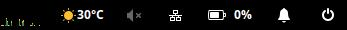

# Wingpanel Weather Indicator




## Building from code


Run `meson` to configure the build environment and then `ninja` to build

    meson build --prefix=/usr
    cd build
    ninja

To install, use `ninja install`

    sudo ninja install


## Installation

Download prebuild binairy from [Release](https://github.com/kunalkushwaha/wingpanel-indicator-weather/releases)

Install it by coping file to wingpanel plugin folder as below.

```
sudo cp libweather.so /usr/lib/x86_64-linux-gnu/wingpanel/libweather.so

pkill -9 wingpanel
```

### NOTE:

Get secret key from [openweathermap.org](https://openweathermap.org/api) and store it in your config file.

    cat ~/.weather.config
    {
        "key":"XXXXXXXXXXXXXXXXXXXX"
    }
